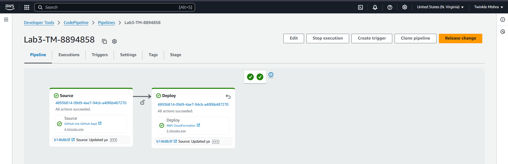
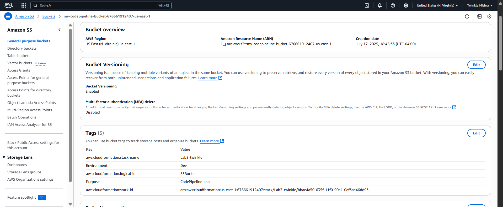
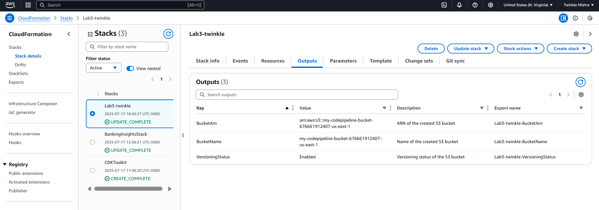
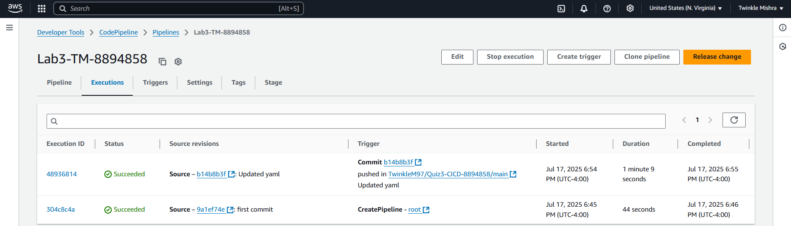
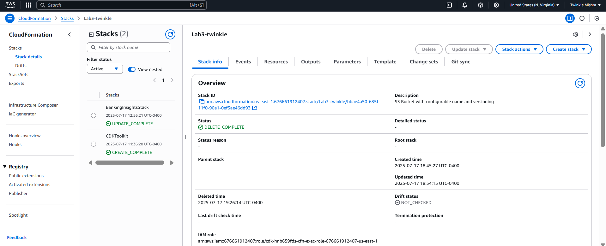

# Lab 3: Automated Infrastructure Deployment with AWS CodePipeline

**Name**: Twinkle Mishra  
**Student ID**: 8894858  

---

## Objective

The purpose of this lab is to demonstrate how to automate the deployment of AWS infrastructure using AWS CodePipeline and AWS CloudFormation. The pipeline is triggered by commits pushed to a GitHub repository and deploys a secure, versioned S3 bucket.

---

## Technologies Used

- AWS CloudFormation
- AWS CodePipeline
- GitHub
- Amazon S3

---

## What Was Built

- A CloudFormation YAML template that creates an Amazon S3 bucket with:
  - Parameterized name and versioning status
  - Block public access configuration
  - AES-256 server-side encryption
  - Tagging and exportable outputs

- A GitHub-hosted CI/CD pipeline using AWS CodePipeline:
  - **Source stage**: Connected to GitHub repo `Quiz3-CICD-8894858`
  - **Deploy stage**: Deploys using CloudFormation with the pushed template
  - Pipeline auto-triggers on each push to `main` branch

---

## Steps Performed

1. Wrote and validated a CloudFormation YAML template (`s3-bucket-template.yaml`).
2. Pushed the template to GitHub under the main branch.
3. Created a CodePipeline with source from GitHub and deploy using AWS CloudFormation.
4. Triggered the pipeline via GitHub push.
5. Verified S3 bucket creation, encryption, and versioning.
6. Triggered another deployment by updating the template.
7. Deleted the stack to clean up AWS resources.

---

## Screenshots

### 1. GitHub Repository
CloudFormation template committed to main branch  

---

### 2. CodePipeline Configuration
Source and Deploy stages successful  

---

### 3. S3 Bucket Overview
Shows versioning enabled, encryption, and tags  

---

### 4. CloudFormation Stack Outputs
Stack with exported outputs: Bucket name, ARN, versioning status  

---

### 5. Pipeline Executions
Pipeline triggered automatically after a GitHub commit  

---

### 6. Stack Deletion Confirmation
Clean deletion of resources via CloudFormation  

---

## Cleanup

The CloudFormation stack was deleted to ensure no resources remain and to avoid unnecessary billing.

---
